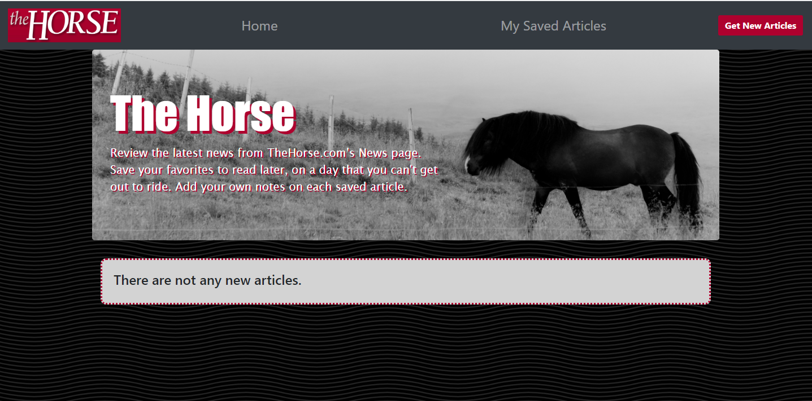
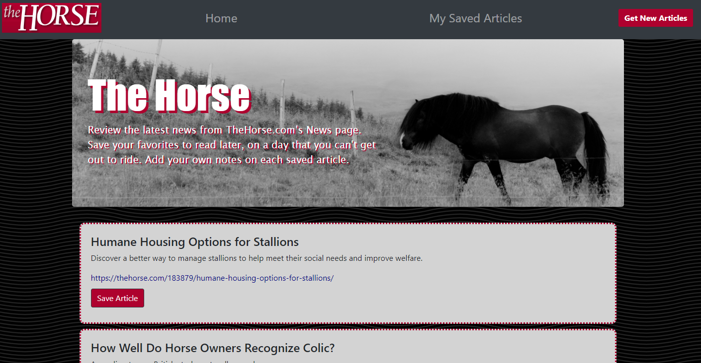
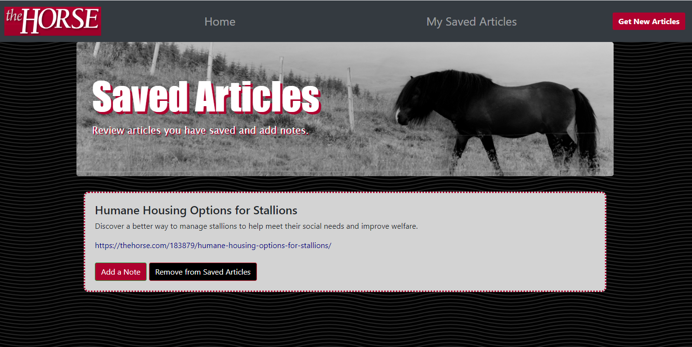

# The Horse Edition of mongo news scraper
A mobile-responsive web app that lets users view, save, and make notes on news from TheHorse.com. The app uses Mongoose, Cheerio, Express, Express-handlebars, and Axios.

created by Jennifer Gaumnitz
____________

A web app that lets users view, save, and make notes on news from TheHorse.com. The app uses Mongoose, Cheerio, Express, Express-handlebars, and Axios. User

- - - -
Heroku deployed app: ADD LINK

GitHub repository: https://github.com/JLGaumnitz/mongo-news-scraper
- - - -

### How You Can Get Started With This Project ###

<strong>To use the app:</strong> 

Simply go to the Heroku link above. 

Click on the "Get New Articles" button at top right, which activates the scraping article titles and links from TheHorse.com's News webpage.

Then click the Home button to see the articles displayed on the Home page. 

If you wish to save an article and make notes on it, click the "Save Article" below the article you wish to save.

The article is then moved from the Home page and moved to the Saved Articles page. Click on "My Saved Articles" in the navigation bar. And you will see the list with buttons for adding a note or removing it from your list of saved articles.

If you click the "Add a Note" button, a modal appears with a field to add a note.

You can delete notes by clicking the red "X" next to the note you wish to delete.

To move an article out of this list, click the button that says "Remove from Saved Articles" and it moves back to the Home page. (All notes are lost when the article is moved out of the Saved Articles list.)

"The Horse" logo at the top left is an active link that takes you to the main page of thehorse.com. The other links are red if not followed, gray on hover, and black if followed.

<strong>To create the app from my files in my GitHub repository:</strong> 

To install and use this application yourself, clone the GitHub repository. 

You will need to have installed:

* Node
* And these dependencies: 
    * axios: 0.19.1
    * cheerio: 1.0.0-rc.3
    * express: 4.17.1
    * express-handlebars: 3.1.0
    * mongoose: 5.8.7
    * morgan: 1.9.1 

Before running the server.js file using node.js, you will need to run "npm install." You will also need to have mongo installed and be running mongod.

Then run "node server.js" at the command line to begin the server, and then navigate to localhost:3000 in your browser to see the HTML home page and proceed from there.

### Why the Project is Useful ###

  The app fulfills a homework assignment for University of Kansas Coding Boot Camp, August 2019 to February 2020. Besides allowing me to continue working with Node.js and npm packages, the assignment also allowed me to work with express, express-handlebars, and MySQL.

### Where Users Can Get Help with This Project ###

  Questions? Contact Jennifer Gaumnitz at jlgaumnitz@gmail.com

### Who Maintains and Contributes to the Project ###

  Jennifer Gaumnitz created the project. I probably will not update it again after completing this assignment. 
